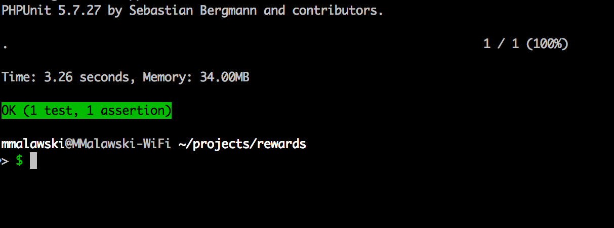
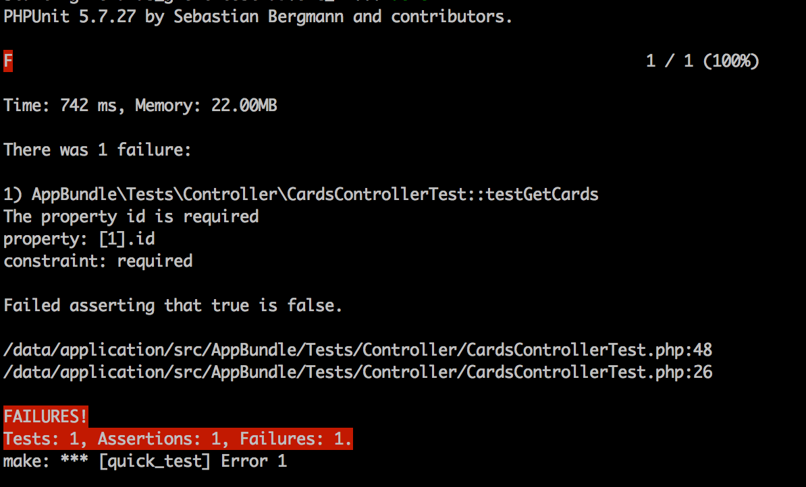
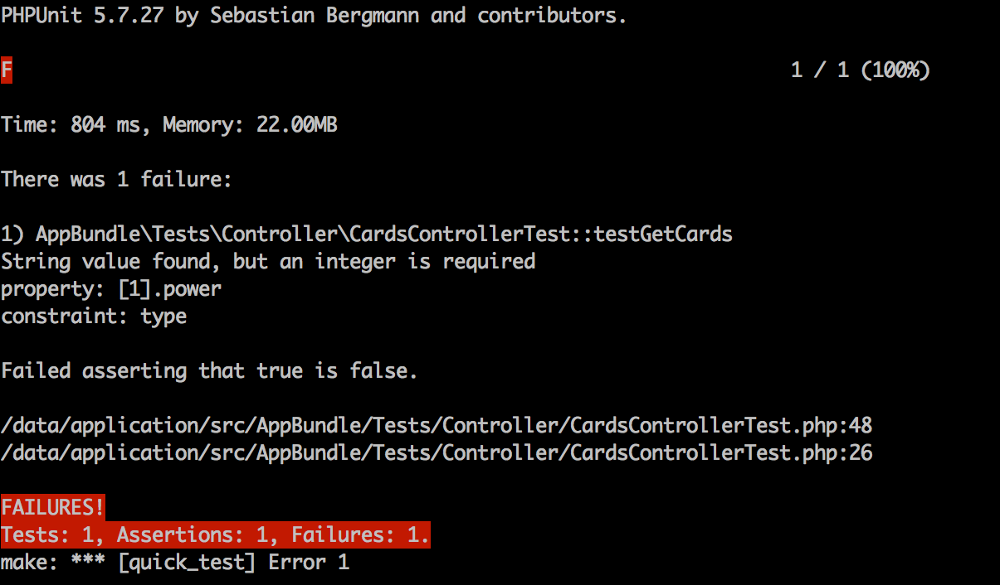

## What is this? 

Validate data against openapi v3 spec [https://github.com/OAI/OpenAPI-Specification]

## Requirements

Your openapi spec has to be valid, You can use [https://github.com/wework/speccy] to check Your schema first

This library assumes that each operation has operationId

## Examples

Given we have api described by following OpenAPI specification

```yaml
openapi: 3.0.2
info:
  title: Cards
  description: Cards and decks api
  contact:
    name: Mieszko Malawski
  license:
    name: GNU AGPLv3
    url: https://www.gnu.org/licenses/agpl.txt
  version: 1.0.0
tags:
  -
    name: Cards
paths:
  /cards:
    summary: Path used to manage the list of cards.
    description: The REST endpoint/path used to list and create zero or more card entities.  This path contains a GET and POST operation to perform the list and create tasks, respectively.
    get:
      tags:
        - Cards
      summary: List All cards
      description: Gets a list of all card entities.
      operationId: getcards
      responses:
        200:
          description: Successful response - returns an array of card entities.
          content:
            application/json:
              schema:
                type: array
                items:
                  $ref: '#/components/schemas/card'
components:
  schemas:
    card:
      title: Root Type for card
      description: The root of the card type's schema.
      required:
      - id
      - name
      - power
      type: object
      properties:
        id:
          description: "unique id"
          type: string
          format: int64
          readOnly: true
        name:
          type: string
        power:
          description: "how powerfull card is on the board"
          format: int32
          type: integer
      example:
        id: "23423423"
        name: "Geralt"
        power: 10
```

We have server implementation (this is of course example - normally You would fetch data from some storage)

```php
<?php
declare(strict_types=1);


namespace AppBundle\Controller;


use GOG\Common\OAuthSecurityBundle\Controller\OAuthController;
use Symfony\Component\HttpFoundation\JsonResponse;

class CardsController extends OAuthController
{
    public function getCardsAction()
    {
        return new JsonResponse(
            [
                [
                    'id' => '123123',
                    'name' => 'Geralt',
                    'power' => 10,
                ],
                [
                    'id' => '45653',
                    'name' => 'Vernon Roche',
                    'power' => 10,
                ]
            ]
        );
    }
}
```

How to verify that server implementation works as described? Use openapi-validator with any http client:

```php
<?php
declare(strict_types=1);


namespace AppBundle\Tests\Controller;


use Mmal\OpenapiValidator\Validator;
use Symfony\Component\Yaml\Yaml;

class CardsControllerTest extends BaseControllerTest
{
    const SPEC_PATH = __DIR__.'/../../../../docs/api.yml';
    
    /** @var Validator */
    static $openaApiValidator;

    static public function setUpBeforeClass()
    {
        parent::setUpBeforeClass();
        self::$openaApiValidator = new Validator(Yaml::parse(self::SPEC_PATH));
    }

    public function testGetCards()
    {
        $this->makeRequest('GET', '/cards');
    }

    protected function makeRequest($method, $uri, $content = '')
    {
        $client = $this->getTestClient();
        $client->request(
            $method,
            $uri
        );
        $response = $client->getResponse();

        $result = self::$openaApiValidator->validateBasedOnRequest(
            $uri,
            $method,
            $response->getStatusCode(),
            json_decode($response->getContent(), true)
        );
        self::assertFalse($result->hasErrors(), $result);

        return RESTResponse::fromHTTPResponse($response);
    }
}
```

1. Load Your spec to validator
2. Make request with any http client
3. Pass request uri, request method, response code and response body to validator (and optionally media type, default is application/json)
4. Validator will find figure out that for method 'GET', path '/cards' and response code 200, required response schema is:
```yaml
card:
  title: Root Type for card
  description: The root of the card type's schema.
  required:
  - id
  - name
  - power
  type: object
  properties:
	id:
	  description: "unique id"
	  type: string
	  format: int64
	  readOnly: true
	name:
	  type: string
	power:
	  description: "how powerfull card is on the board"
	  format: int32
	  type: integer
  example:
	id: "23423423"
	name: "Geralt"
	power: 10
```
5. Actual response body is validated against that schema
6. Result object is produced, if response is invalid then result object will contain errors

In this case response is valid:



Lets now introduce some errors:

```php
 public function getCardsAction()
    {
        return new JsonResponse(
            [
                [
                    'id' => '123123',
                    'name' => 'Geralt',
                    'power' => 10,
                ],
                [
                 //   'id' => '45653',
                    'name' => 'Vernon Roche',
                    'power' => 10,
                ]
            ]
        );
    }
```

Required id field for second item is missing:



Lets break something else 

```php
public function getCardsAction()
    {
        return new JsonResponse(
            [
                [
                    'id' => '123123',
                    'name' => 'Geralt',
                    'power' => 10,
                ],
                [
                    'id' => '45653',
                    'name' => 'Vernon Roche',
                    'power' => '10',
                ]
            ]
        );
    }
```

power field should be integer (second item):



## Other libraries

1. Dredd [https://github.com/apiaryio/dredd] - currently supports only swagger/openapi v2, support for v3 is not yet there
2. [https://github.com/WakeOnWeb/swagger] - support for v2 only 

## Features

1. Supports discriminator
2. Supports nullable
3. Resolves dependecies (schema and response components)

## TODO

1. Support all openapi formats
2. Support for not keyword

## How this works?

Transform openapi spec into json schema and then uses justinrainbow/json-schema to validate it